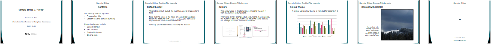

# PowerPoint Templates

This repository contains the PowerPoint templates I've been using along with demo PDFs. 

## Velis

 [lrk-slides-velis](https://github.com/lrkrol/powerpoint) by [Laurens R. Krol](https://lrkrol.com) is licensed under [CC0 1.0](https://creativecommons.org/publicdomain/zero/1.0)

Velis is a simple, unassuming template inspired by traditional stage curtains.
- Single- and double-title designs, the latter e.g. to include section breadcrumbs.
- A number of slide layouts for each design.
- Template graphics are linked to the [colour theme](https://coolors.co/005c69-89b0ae-d73371-dba8ac-58641d-bcbf79) (using "Accent 1"), which can easily be changed.
- Correct input field order on each slide.
- Special closing slide layout.

- [Download Velis template](https://github.com/lrkrol/powerpoint/raw/master/lrk-slides-velis.potx)
- [Download Velis sample slides (PDF)](https://github.com/lrkrol/powerpoint/raw/master/docs/lrk-slides-velis-sample.pdf)
